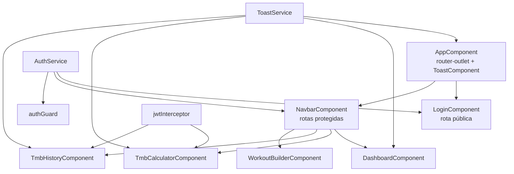
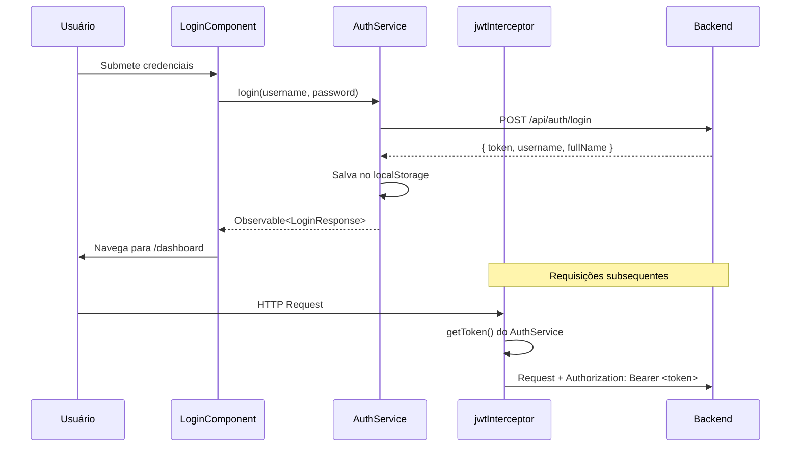
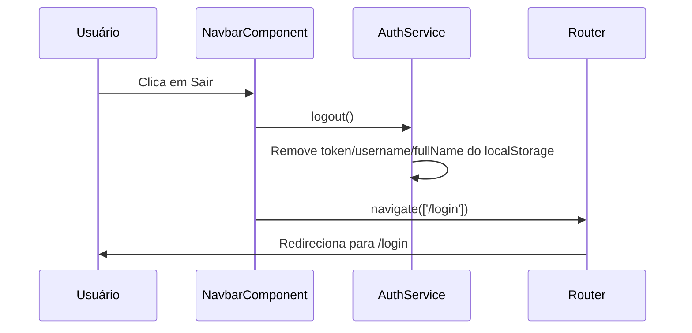

# Design Document — NUTRIX Frontend Redesign

## Overview

Este documento descreve o design técnico do redesign completo do frontend NUTRIX, uma aplicação Angular 17+ com standalone components conectada a um backend Spring Boot em `http://localhost:8080` com autenticação JWT.

O redesign abrange três eixos principais:

1. **Correções de bugs críticos** — logout sem redirecionamento, interceptor JWT não cobrindo todas as rotas, uso de `alert()` nativo.
2. **Novos componentes globais** — `ToastService`/`ToastComponent` para notificações in-app e `NavbarComponent` para navegação consistente.
3. **Reformulação visual completa** — Design System verde (`#22c55e`), fonte Inter, layouts modernos com gradientes, cards, skeleton loaders e responsividade mobile-first.

### Tecnologias e Restrições

| Item | Detalhe |
|---|---|
| Framework | Angular 17+ (standalone components, functional guards/interceptors) |
| Backend | Spring Boot em `http://localhost:8080` |
| Autenticação | JWT armazenado em `localStorage` |
| Cor principal | Verde — `#22c55e` / `#16a34a` |
| Fonte | Inter (Google Fonts) |
| CSS | SCSS com variáveis CSS custom properties |

---

## Architecture

A arquitetura segue o padrão já estabelecido no projeto: feature modules com standalone components, serviços injetáveis com `providedIn: 'root'`, guards e interceptors funcionais.



### Fluxo de Autenticação



### Fluxo de Logout



---

## Components and Interfaces

### 1. Design System — `styles.scss`

Arquivo global que define todas as variáveis CSS e classes utilitárias. Substitui completamente o `styles.scss` atual.

**Variáveis CSS (`:root`):**

```scss
:root {
  // Paleta verde principal
  --color-primary: #22c55e;
  --color-primary-dark: #16a34a;
  --color-primary-darker: #15803d;
  --color-primary-light: #4ade80;
  --color-primary-bg: #f0fdf4;

  // Gradiente principal
  --gradient-primary: linear-gradient(135deg, #16a34a 0%, #22c55e 100%);
  --gradient-hero: linear-gradient(135deg, #15803d 0%, #16a34a 50%, #22c55e 100%);

  // Paleta neutra
  --color-text-primary: #1e293b;
  --color-text-secondary: #334155;
  --color-text-muted: #64748b;
  --color-bg-page: #f1f5f9;
  --color-bg-card: #ffffff;
  --color-border: #e2e8f0;

  // Feedback
  --color-error: #ef4444;
  --color-error-bg: #fef2f2;
  --color-success: #22c55e;
  --color-info: #3b82f6;
  --color-info-bg: #eff6ff;
  --color-warning: #f59e0b;

  // Tipografia
  --font-family: 'Inter', sans-serif;
  --font-size-xs: 0.75rem;
  --font-size-sm: 0.875rem;
  --font-size-base: 1rem;
  --font-size-lg: 1.125rem;
  --font-size-xl: 1.25rem;
  --font-size-2xl: 1.5rem;
  --font-size-3xl: 1.875rem;

  // Espaçamento
  --spacing-xs: 0.25rem;
  --spacing-sm: 0.5rem;
  --spacing-md: 1rem;
  --spacing-lg: 1.5rem;
  --spacing-xl: 2rem;
  --spacing-2xl: 3rem;

  // Border radius
  --radius-sm: 0.375rem;
  --radius-md: 0.5rem;
  --radius-lg: 0.75rem;
  --radius-xl: 1rem;
  --radius-full: 9999px;

  // Sombras
  --shadow-sm: 0 1px 2px rgba(0,0,0,0.05);
  --shadow-md: 0 4px 6px rgba(0,0,0,0.07), 0 2px 4px rgba(0,0,0,0.06);
  --shadow-lg: 0 10px 15px rgba(0,0,0,0.1), 0 4px 6px rgba(0,0,0,0.05);
  --shadow-xl: 0 20px 25px rgba(0,0,0,0.1), 0 10px 10px rgba(0,0,0,0.04);

  // Transições
  --transition-fast: 150ms ease;
  --transition-base: 250ms ease;
  --transition-slow: 350ms ease;
}
```

### 2. `ToastService`

**Localização:** `src/app/core/services/toast.service.ts`

```typescript
export interface Toast {
  id: string;
  type: 'success' | 'error' | 'info';
  message: string;
  createdAt: number;
}
```

**Interface pública:**
- `showSuccess(message: string): void`
- `showError(message: string): void`
- `showInfo(message: string): void`
- `toasts$: Observable<Toast[]>` — signal/BehaviorSubject para o componente consumir
- `dismiss(id: string): void` — remove um toast pelo id

**Comportamento:** Cada toast recebe um `id` único (UUID ou timestamp), é adicionado à lista e removido automaticamente após 4000ms via `setTimeout`.

### 3. `ToastComponent`

**Localização:** `src/app/shared/components/toast/toast.component.ts`

**Standalone component** importado diretamente no `AppComponent`.

**Template:** Container fixo no canto superior direito (`position: fixed; top: 1rem; right: 1rem; z-index: 9999`), lista de toasts empilhados verticalmente com animação de entrada/saída.

**Ícones por tipo:**
- `success` → ✅ fundo verde claro, borda verde
- `error` → ❌ fundo vermelho claro, borda vermelha
- `info` → ℹ️ fundo azul claro, borda azul

### 4. `NavbarComponent`

**Localização:** `src/app/shared/components/navbar/navbar.component.ts`

**Standalone component** incluído no `AppComponent` condicionalmente (exibido apenas quando `authService.isAuthenticated()` é `true`).

**Template:**
```
[NUTRIX logo → /dashboard]    [👤 Nome do usuário]  [Sair]
```

**Responsividade mobile (< 768px):** Oculta o nome completo, exibe apenas avatar inicial e botão de logout.

**Integração:** Chama `authService.logout()` e `router.navigate(['/login'])` no clique de logout.

### 5. `AuthService` — Correção do `logout()`

**Arquivo:** `src/app/core/services/auth.service.ts`

**Problema atual:** `logout()` remove os dados do localStorage mas não redireciona para `/login`. O `DashboardComponent` chama `this.router.navigate(['/dashboard'])` após o logout — bug que mantém o usuário na mesma tela.

**Solução:** Injetar `Router` no `AuthService` e incluir `this.router.navigate(['/login'])` dentro do método `logout()`. Alternativamente (preferível para separação de responsabilidades), o `NavbarComponent` chama `authService.logout()` e em seguida `router.navigate(['/login'])` — o `AuthService` permanece sem dependência do `Router`.

**Decisão de design:** O `NavbarComponent` (e qualquer componente que chame logout) é responsável pela navegação pós-logout. O `AuthService.logout()` permanece focado em limpar o estado de autenticação.

### 6. `jwtInterceptor` — Verificação

**Arquivo:** `src/app/core/interceptors/jwt.interceptor.ts`

**Análise:** O interceptor atual já está correto — injeta `AuthService`, obtém o token e adiciona o header `Authorization: Bearer <token>` se o token existir. O problema reportado de "não enviar token no histórico TMB" provavelmente é causado pelo interceptor não estar registrado no `app.config.ts`.

**Verificação necessária:** Confirmar que `provideHttpClient(withInterceptors([jwtInterceptor]))` está configurado em `app.config.ts`.

### 7. `LoginComponent` — Redesign

**Layout 2 painéis (desktop):**

```
┌─────────────────────┬─────────────────────┐
│   PAINEL ESQUERDO   │   PAINEL DIREITO    │
│   (gradiente verde) │   (formulário)      │
│                     │                     │
│  🌿 NUTRIX          │  Bem-vindo de volta │
│                     │                     │
│  "Transforme seu    │  [campo usuário]    │
│   corpo, transforme │  [campo senha]      │
│   sua vida"         │  [btn Entrar]       │
│                     │                     │
│  • TMB Calculator   │                     │
│  • Workout Builder  │                     │
└─────────────────────┴─────────────────────┘
```

**Mobile (< 768px):** Apenas o painel direito em tela cheia.

### 8. `DashboardComponent` — Redesign

**Layout:**
- Navbar no topo (via `NavbarComponent`)
- Saudação personalizada: "Bom dia, João! 🌅" / "Boa tarde, João! ☀️" / "Boa noite, João! 🌙"
- Grid 2×2 de feature cards (2 colunas desktop, 1 coluna mobile)

**Feature cards:**
- Cards ativos: gradiente verde, ícone grande, título, descrição, seta →
- Cards inativos: fundo cinza, badge "Em breve", cursor não-permitido
- Hover em cards ativos: `transform: translateY(-4px)`, sombra aumentada

**Remoção do botão logout inline** — substituído pelo `NavbarComponent`.

### 9. `TmbCalculatorComponent` — Redesign

**Adições:**
- Botão "← Voltar ao Dashboard" no cabeçalho
- Substituição de `alert()` por `ToastService`
- Campos agrupados em grid 2 colunas
- Resultado em cards com gradiente verde (TMB card + TDEE card)
- Spinner inline no botão durante `isLoading`

### 10. `TmbHistoryComponent` — Redesign

**Adições:**
- Skeleton loader (3 cards placeholder animados) durante `isLoading`
- Empty state com ícone 📊, mensagem e botão "Fazer Primeiro Cálculo"
- Cards com layout de timeline (linha vertical à esquerda, data no topo)
- Indicador de tendência entre registros consecutivos (↑ verde / ↓ vermelho / → cinza)
- Substituição de `alert()` por `ToastService`

---

## Data Models

### Toast

```typescript
interface Toast {
  id: string;           // UUID gerado no momento da criação
  type: 'success' | 'error' | 'info';
  message: string;
  createdAt: number;    // Date.now() para ordenação
}
```

### TmbHistory (existente, sem alteração)

```typescript
interface TmbHistory {
  id: number;
  weightKg: number;
  heightCm: number;
  ageYears: number;
  biologicalSex: 'MALE' | 'FEMALE';
  activityLevel: 'SEDENTARY' | 'LIGHTLY_ACTIVE' | 'MODERATELY_ACTIVE' | 'VERY_ACTIVE' | 'EXTREMELY_ACTIVE';
  tmbKcal: number;
  tdeeKcal: number;
  calculatedAt: string; // ISO 8601
}
```

### GreetingPeriod (novo, para o Dashboard)

```typescript
type GreetingPeriod = 'morning' | 'afternoon' | 'evening';

function getGreetingPeriod(hour: number): GreetingPeriod {
  if (hour >= 5 && hour < 12) return 'morning';
  if (hour >= 12 && hour < 18) return 'afternoon';
  return 'evening';
}
```

### TrendIndicator (novo, para o Histórico TMB)

```typescript
type TrendDirection = 'up' | 'down' | 'stable';

interface TrendIndicator {
  direction: TrendDirection;
  delta: number; // diferença absoluta em kcal
}

function calculateTrend(current: number, previous: number): TrendIndicator {
  const delta = current - previous;
  if (Math.abs(delta) < 1) return { direction: 'stable', delta: 0 };
  return { direction: delta > 0 ? 'up' : 'down', delta: Math.abs(delta) };
}
```

---

## Correctness Properties

*Uma propriedade é uma característica ou comportamento que deve ser verdadeiro em todas as execuções válidas de um sistema — essencialmente, uma declaração formal sobre o que o sistema deve fazer. Propriedades servem como ponte entre especificações legíveis por humanos e garantias de corretude verificáveis por máquinas.*

### Property 1: Logout limpa completamente o estado de autenticação

*Para qualquer* conjunto de valores de token JWT, username e fullName armazenados no localStorage, após chamar `AuthService.logout()`, nenhum desses valores deve permanecer acessível via `getToken()`, `getUsername()` ou `getFullName()`.

**Validates: Requirements 1.1**

---

### Property 2: authGuard bloqueia acesso sem autenticação

*Para qualquer* rota protegida pelo `authGuard`, quando `AuthService.isAuthenticated()` retorna `false`, o guard deve retornar um `UrlTree` apontando para `/login` (nunca `true`).

**Validates: Requirements 1.3**

---

### Property 3: JWT Interceptor injeta token em todas as requisições autenticadas

*Para qualquer* URL de requisição HTTP e qualquer token JWT válido armazenado, o `jwtInterceptor` deve adicionar o header `Authorization: Bearer <token>` à requisição clonada.

**Validates: Requirements 2.1**

---

### Property 4: JWT Interceptor não injeta header sem token

*Para qualquer* URL de requisição HTTP quando nenhum token está armazenado (`getToken()` retorna `null`), o `jwtInterceptor` deve encaminhar a requisição original sem o header `Authorization`.

**Validates: Requirements 2.2**

---

### Property 5: Toast renderiza com tipo e estilo corretos

*Para qualquer* mensagem de texto e qualquer tipo de toast (`success`, `error`, `info`), o `ToastComponent` deve renderizar o toast com a classe CSS correspondente ao tipo e o ícone correto.

**Validates: Requirements 3.2**

---

### Property 6: Toasts preservam ordem de inserção

*Para qualquer* sequência de N chamadas a `showSuccess`/`showError`/`showInfo`, a lista de toasts exibida deve preservar a ordem de inserção (FIFO), sem inversão ou reordenação.

**Validates: Requirements 3.4**

---

### Property 7: Clique em toast o remove imediatamente

*Para qualquer* toast presente na lista de toasts ativos, simular um clique nele deve resultar na remoção imediata desse toast da lista (sem aguardar o timeout de 4000ms).

**Validates: Requirements 3.6**

---

### Property 8: Validação de formulário exibe erros para campos inválidos

*Para qualquer* campo do formulário de login ou TMB que esteja no estado `touched` e `invalid`, a mensagem de erro correspondente deve ser exibida no template.

**Validates: Requirements 6.3, 9.2**

---

### Property 9: Cards do Dashboard renderizam todos os campos obrigatórios

*Para qualquer* lista de features configuradas no `DashboardComponent`, cada card renderizado deve conter o ícone, o título e a descrição da feature correspondente.

**Validates: Requirements 8.2**

---

### Property 10: Card inativo sempre dispara notificação info

*Para qualquer* feature com `active: false`, clicar no card correspondente deve resultar em uma chamada a `ToastService.showInfo` (nunca navegar para uma rota).

**Validates: Requirements 8.4**

---

### Property 11: Saudação corresponde corretamente ao período do dia

*Para qualquer* hora entre 0 e 23, a função `getGreetingPeriod(hour)` deve retornar `'morning'` para horas 5–11, `'afternoon'` para horas 12–17, e `'evening'` para horas 18–4 (incluindo 0–4).

**Validates: Requirements 8.5**

---

### Property 12: Resultado TMB exibe valores calculados corretamente

*Para qualquer* `TmbResponse` com valores de `tmbKcal` e `tdeeKcal`, após a conclusão do cálculo, os valores exibidos nos cards de resultado devem corresponder exatamente aos valores recebidos na resposta.

**Validates: Requirements 9.3**

---

### Property 13: Histórico TMB exibido em ordem decrescente de data

*Para qualquer* lista de registros `TmbHistory` com datas variadas, os cards exibidos pelo `TmbHistoryComponent` devem estar ordenados de forma que `history[i].calculatedAt >= history[i+1].calculatedAt` para todo `i`.

**Validates: Requirements 10.1**

---

### Property 14: Cards de histórico exibem todos os campos do registro

*Para qualquer* registro `TmbHistory`, o card renderizado deve conter a data formatada, os valores de `tmbKcal` e `tdeeKcal`, e os parâmetros utilizados (peso, altura, idade, sexo, nível de atividade).

**Validates: Requirements 10.2**

---

### Property 15: Indicador de tendência reflete corretamente a variação de TDEE

*Para qualquer* par de registros consecutivos `(current, previous)`, o indicador de tendência deve exibir `↑` quando `current.tdeeKcal > previous.tdeeKcal`, `↓` quando menor, e `→` quando a diferença for inferior a 1 kcal.

**Validates: Requirements 10.6**

---

## Error Handling

### Erros de Autenticação

| Cenário | Tratamento |
|---|---|
| Login com credenciais inválidas | `ToastService.showError(error.error?.message \|\| 'Credenciais inválidas')` |
| Requisição retorna HTTP 401 | Redirecionar para `/login` + `ToastService.showError('Sessão expirada')` |
| Token ausente em rota protegida | `authGuard` redireciona para `/login` |

### Erros de Operações TMB

| Cenário | Tratamento |
|---|---|
| Falha no cálculo TMB | `ToastService.showError('Erro ao calcular TMB. Tente novamente.')` |
| Falha ao salvar no histórico | `ToastService.showError('Erro ao salvar no histórico.')` |
| Falha ao carregar histórico | `ToastService.showError('Erro ao carregar histórico.')` |

### Erros de Navegação

| Cenário | Tratamento |
|---|---|
| Rota não encontrada (`**`) | Redireciona para `/dashboard` (comportamento atual mantido) |
| Acesso a rota protegida sem token | `authGuard` redireciona para `/login` |

### Estratégia Global

- **Nunca usar `alert()`** — todas as notificações passam pelo `ToastService`.
- **Botões desabilitados durante loading** — previne submissões duplicadas.
- **Mensagens de erro amigáveis** — sem stack traces ou mensagens técnicas expostas ao usuário.
- **Fallback de nome** — se `fullName` não estiver disponível, usar `username`; se nenhum, usar `'Usuário'`.

---

## Testing Strategy

### Abordagem Dual

A estratégia combina testes unitários com exemplos concretos e testes baseados em propriedades (PBT) para cobertura abrangente.

**Biblioteca PBT:** [`fast-check`](https://fast-check.dev/) — biblioteca TypeScript/JavaScript madura para property-based testing, compatível com Jest e Jasmine (framework padrão do Angular CLI).

```bash
npm install --save-dev fast-check
```

### Testes Unitários (Exemplos e Edge Cases)

**`AuthService`:**
- Login bem-sucedido salva token, username e fullName no localStorage
- Login com erro não salva nada no localStorage
- `isAuthenticated()` retorna `true` com token presente, `false` sem token

**`ToastService`:**
- `showSuccess` cria toast com `type: 'success'`
- `showError` cria toast com `type: 'error'`
- `showInfo` cria toast com `type: 'info'`
- Toast é removido após 4000ms (usando `fakeAsync`/`tick`)

**`LoginComponent`:**
- Exibe spinner e desabilita botão quando `isLoading = true`
- Chama `ToastService.showError` quando login falha
- Navega para `/dashboard` quando login tem sucesso

**`TmbCalculatorComponent`:**
- Exibe spinner e desabilita botão quando `isLoading = true`
- Chama `ToastService.showError` quando cálculo falha
- Chama `ToastService.showSuccess` quando salvamento tem sucesso
- Botão "Voltar ao Dashboard" navega para `/dashboard`

**`TmbHistoryComponent`:**
- Exibe skeleton loader quando `isLoading = true`
- Exibe empty state quando `history = []`
- Chama `ToastService.showError` quando carregamento falha

**`NavbarComponent`:**
- Exibe nome do usuário obtido via `AuthService.getFullName()`
- Clique em logout chama `AuthService.logout()` e navega para `/login`
- Logo navega para `/dashboard`

### Testes de Propriedade (fast-check)

Cada teste de propriedade deve executar no mínimo **100 iterações**.

Tag de referência: `// Feature: nutrix-frontend-redesign, Property N: <texto>`

**Property 1 — Logout limpa estado:**
```typescript
// Feature: nutrix-frontend-redesign, Property 1: Logout limpa completamente o estado de autenticação
fc.assert(fc.property(
  fc.string(), fc.string(), fc.string(),
  (token, username, fullName) => {
    localStorage.setItem('nutrix_token', token);
    localStorage.setItem('nutrix_username', username);
    localStorage.setItem('nutrix_fullname', fullName);
    authService.logout();
    return authService.getToken() === null
      && authService.getUsername() === null
      && authService.getFullName() === null;
  }
));
```

**Property 2 — authGuard bloqueia sem autenticação:**
```typescript
// Feature: nutrix-frontend-redesign, Property 2: authGuard bloqueia acesso sem autenticação
fc.assert(fc.property(
  fc.constantFrom('/dashboard', '/tmb', '/tmb/history', '/workout'),
  (route) => {
    spyOn(authService, 'isAuthenticated').and.returnValue(false);
    const result = authGuard(mockRoute(route), mockState(route));
    return result instanceof UrlTree; // redireciona para /login
  }
));
```

**Property 3 — Interceptor injeta token:**
```typescript
// Feature: nutrix-frontend-redesign, Property 3: JWT Interceptor injeta token em todas as requisições autenticadas
fc.assert(fc.property(
  fc.webUrl(), fc.string({ minLength: 10 }),
  (url, token) => {
    spyOn(authService, 'getToken').and.returnValue(token);
    const req = new HttpRequest('GET', url);
    let capturedReq: HttpRequest<any>;
    jwtInterceptor(req, (r) => { capturedReq = r; return of(new HttpResponse()); });
    return capturedReq!.headers.get('Authorization') === `Bearer ${token}`;
  }
));
```

**Property 5 — Toast renderiza com tipo correto:**
```typescript
// Feature: nutrix-frontend-redesign, Property 5: Toast renderiza com tipo e estilo corretos
fc.assert(fc.property(
  fc.string({ minLength: 1 }),
  fc.constantFrom('success', 'error', 'info'),
  (message, type) => {
    toastService[`show${type.charAt(0).toUpperCase() + type.slice(1)}`](message);
    const toasts = toastService.getToasts();
    const last = toasts[toasts.length - 1];
    return last.type === type && last.message === message;
  }
));
```

**Property 11 — Saudação por hora do dia:**
```typescript
// Feature: nutrix-frontend-redesign, Property 11: Saudação corresponde corretamente ao período do dia
fc.assert(fc.property(
  fc.integer({ min: 0, max: 23 }),
  (hour) => {
    const period = getGreetingPeriod(hour);
    if (hour >= 5 && hour < 12) return period === 'morning';
    if (hour >= 12 && hour < 18) return period === 'afternoon';
    return period === 'evening';
  }
));
```

**Property 13 — Histórico em ordem decrescente:**
```typescript
// Feature: nutrix-frontend-redesign, Property 13: Histórico TMB exibido em ordem decrescente de data
fc.assert(fc.property(
  fc.array(fc.record({
    id: fc.integer(),
    tmbKcal: fc.float({ min: 1000, max: 4000 }),
    tdeeKcal: fc.float({ min: 1200, max: 6000 }),
    calculatedAt: fc.date().map(d => d.toISOString()),
    weightKg: fc.float({ min: 40, max: 200 }),
    heightCm: fc.float({ min: 140, max: 220 }),
    ageYears: fc.integer({ min: 1, max: 120 }),
    biologicalSex: fc.constantFrom('MALE', 'FEMALE'),
    activityLevel: fc.constantFrom('SEDENTARY', 'LIGHTLY_ACTIVE', 'MODERATELY_ACTIVE', 'VERY_ACTIVE', 'EXTREMELY_ACTIVE')
  }), { minLength: 2 }),
  (records) => {
    component.history = records;
    const sorted = component.getSortedHistory();
    for (let i = 0; i < sorted.length - 1; i++) {
      if (sorted[i].calculatedAt < sorted[i+1].calculatedAt) return false;
    }
    return true;
  }
));
```

**Property 15 — Indicador de tendência:**
```typescript
// Feature: nutrix-frontend-redesign, Property 15: Indicador de tendência reflete corretamente a variação de TDEE
fc.assert(fc.property(
  fc.float({ min: 1000, max: 6000 }),
  fc.float({ min: 1000, max: 6000 }),
  (currentTdee, previousTdee) => {
    const trend = calculateTrend(currentTdee, previousTdee);
    const delta = currentTdee - previousTdee;
    if (Math.abs(delta) < 1) return trend.direction === 'stable';
    if (delta > 0) return trend.direction === 'up';
    return trend.direction === 'down';
  }
));
```

### Cobertura Esperada

| Camada | Tipo de Teste | Ferramenta |
|---|---|---|
| Serviços (`AuthService`, `ToastService`) | Unitário + Propriedade | Jasmine + fast-check |
| Interceptor JWT | Unitário + Propriedade | Jasmine + fast-check |
| Guards | Unitário + Propriedade | Jasmine + fast-check |
| Componentes (lógica) | Unitário + Propriedade | Jasmine + fast-check |
| Componentes (template) | Snapshot / Exemplo | Jasmine TestBed |
| Funções puras (`getGreetingPeriod`, `calculateTrend`) | Propriedade | fast-check |
| Responsividade | Visual / Smoke | Inspeção manual |
